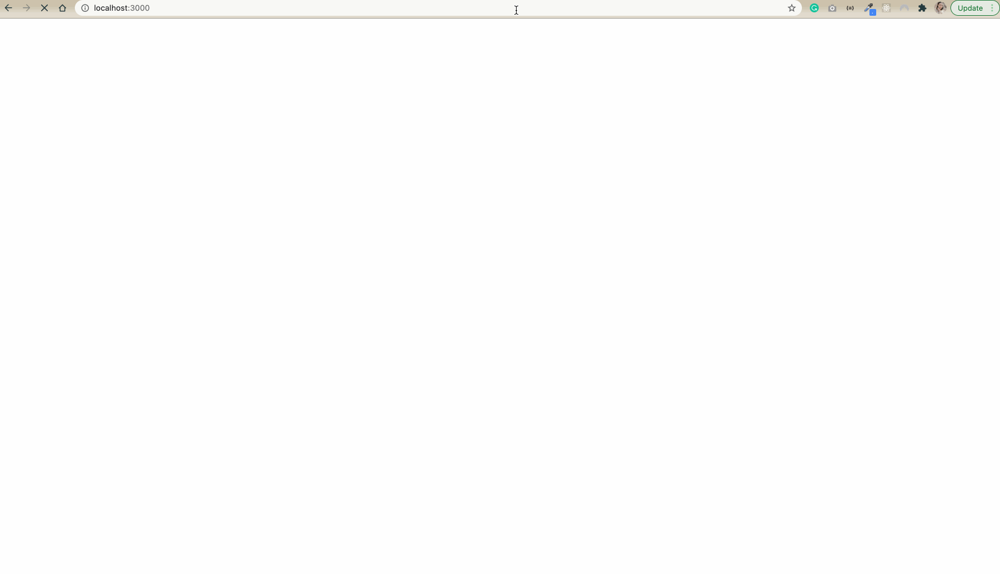
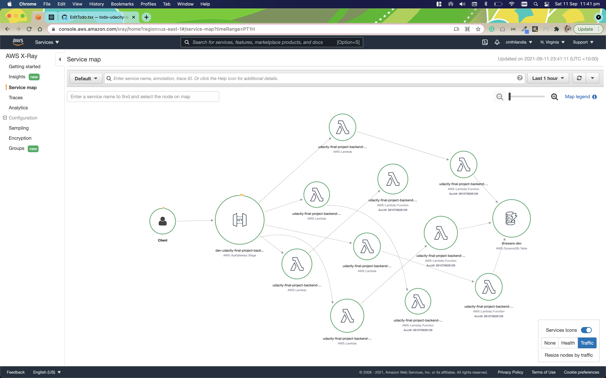

# Udacity final project

I've created an virtual diary application: you will be presented with a different question every day, and repeate them every year.

The idea is that you can see how much you've change over the years.

## Demo



## API

All the API is deployed using Serverle to AWS, and the Client is already configured to work with the API.

The API URL is: https://eekguocox7.execute-api.us-east-1.amazonaws.com/dev.

## Client

You can run the client and use it by executing these commands:

```sh
# clone this repository
git clone https://github.com/cinthialandia/udacity-final-project.git

# cd into client folder
cd ./client

# install the dependencies
yarn install

# run the application
yarn start
```

The Client will redirect you to the Auth0 Login page as soon as you attemp to use it without being authorized.

Once you login, you can start answering questions in the diary, and uploading images

## AWS X-RAY


